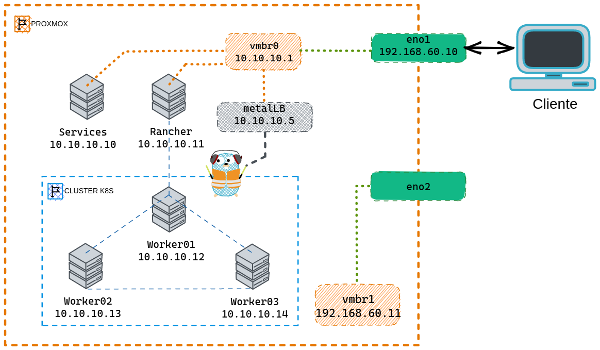

# Cluster kubernetes sobre Proxmox (LABMICRO-FACET)

## Descripción

El proyecto fue desarrollado por el Laboratorio de Microprocesadores de la FACET - UNT, para coloborar con la practica de los alumnos que necesiten lanzar entornos completos de forma rápida y profesional en la nube sin tener que afrontar los costos que representa contratar un servicio de Cloud Computing como GCP, AWS, o Azure entre otros.

## Tecnologías utilizadas

- [Servidor Dell PowerEdge R720](https://www.dell.com/ar/empresas/p/poweredge-r720/pd?sc_err=notincat) ([spec sheet](https://i.dell.com/sites/csdocuments/Shared-Content_data-Sheets_Documents/es/la/Dell-PowerEdge-R720-Spec-Sheet_ES-XL.pdf))
- [Proxmox VE 7.1](https://www.proxmox.com/en/proxmox-ve)
- [Rancher 2.6.8](https://www.rancher.com/products/rancher) ([docs](https://docs.ranchermanager.rancher.io/))
- [MetalLB](https://metallb.universe.tf/)
- [Traefik proxy](https://doc.traefik.io/traefik/)
- [kubectl](https://kubernetes.io/docs/tasks/tools/)
- [Fortune-Teller](https://hub.docker.com/r/mafernandez21/fortune-app)

## Descripción del Cluster laboratorio-micro

### Máquinas Virtuales

ProxmoxVE tiene configuradas las siguentes Máquinas Virtuales (VM):

- VM servicios (actualmente solo cuenta con un servicio DHCPv4)
- VM rancher para la UI del servicio de Rancher.
- 3 VM Que forman parte del cluster k8s bare metal

### Network (10.10.10.0/24)

| VM        | IP          |
|-----------|-------------|
| servicios | 10.10.10.10 |
| rancher   | 10.10.10.11 |
| worker01  | 10.10.10.12 |
| worker02  | 10.10.10.13 |
| worker03  | 10.10.10.14 |

### Configuración por defecto (/etc/network/interfaces)

```bash
auto lo
iface lo inet loopback

iface eno1 inet manual

auto vmbr0
iface vmbr0 inet static
        address [PROXMOX-IP]/[NET-MASK]
        gateway [PROXMOX-GATEWAY]
        bridge-ports eno1
        bridge-stp off
        bridge-fd 0

iface eno2 inet manual

iface eno3 inet manual

iface eno4 inet manual
```

### Configuración con NAT (/etc/network/interfaces)

```bash
auto lo
iface lo inet loopback

auto eno1
#real IP address
iface eno1 inet static
    address  192.168.100.65/24
    gateway  192.168.100.1

auto eno2
iface eno2 inet manual

auto vmbr0
#private sub network
iface vmbr0 inet static
    address  10.10.10.1/24
    bridge-ports none
    bridge-stp off
    bridge-fd 0

    post-up   echo 1 > /proc/sys/net/ipv4/ip_forward
    post-up   iptables -t nat -A POSTROUTING -s '10.10.10.0/24' -o eno1 -j MASQUERADE
    post-down iptables -t nat -D POSTROUTING -s '10.10.10.0/24' -o eno1 -j MASQUERADE

#backup IP address
auto vmbr1
iface vmbr1 inet static
    address  10.0.16.188/24
    bridge-ports eno2
    bridge-stp off
    bridge-fd 0
```

### Topologia

En la siguiente topología se muestra la configuración inicial del cluster. Contamos con dos redes, una privada para los nodos dentro del cluster, y otra es la LAN donde se encuentra el servidor proxmox. A continuación se explica brevemente como funcionan los servicios configurados.

- **Services**: Por el momento solo provee un servicio DHCPv4 para los nodos/hosts conectados en la red privada, en este caso la `10.10.10.0/24`.

- **MetalLB**: Es el proveedor de servicio `Load Balancer` "simulando" un proveedor de cloud computing. En este caso responderá las solicitudes ARP provenientes de la LAN para publicar la `IP 10.10.10.5`, y hacia el cluster va a publicarla como una ip pública.

- **Traefik Proxy**: Es el encargado de redirigir las peticiones entrantes al cluster (a través de la ip provista por MetalLB) hacia los pods que cumplan con las condiciones de nombre y puerto definido en los Servicios tipo `Ingress`.
  - Para activar el dashboard:
    - En los argumentos del contenedor del Deploymnet se deben agregar: `--api.dashboard=true` y `--api.insecure=true`
    - Luego a través `http://localhost:9000/dashboard`, haciendo el port-mapping con : `kubectl -n traefik port-forward $(kubectl -n traefik get pods --selector "app.kubernetes.io/name=traefik" --output=name) 9000:9000`.

- **vmbr0**: Provee la configuración para que la conectividad entre los nodos del cluster sea privada, también tiene configurado un NAT para que los nodos de la red privada puedan "salir" por la interface eno1, esto permite que las aplicaciones desplegadas en el cluster sean accesibles desde el "exterior".
Esta configuración es necesaria para que con pocos cambios el servidor proxmox pueda cambiar de RED sin que se dañe la configuración del cluster de kubernetes.

- **vmbr1**: Provee conectividad entre el servidor proxmox y otra LAN. Esto permite tener una conexión de backup y no perder control sobre el cluster en caso de mala configuración de las interfaces eno1 y/o vmbr0.

Toda la configuración anterior permite que cuando se realice un `GET` a la URL `http://fortuneteller.facet.unt.edu.ar/`, el deployment fortune-teller responda con la página inicial de la aplicación desplegada en el cluster.

```bash
NOTA: El nombre fortuneteller.facet.unt.edu.ar DEBE resolver la ip 10.10.10.5, esto se puede lograr configurando el archivo hosts del sistema o utilizando un servicio DNS.
```



### Rancher UI

La UI de `rancher` es accesible desde [https://10.10.10.11/dashboard/home](https://10.10.10.11/dashboard/home), con las credenciales provistas.


Tambien se puede instalar kubectl y acceder a travéz de la CLI, utilizando la configuración provista por el servicio de rancher.

### Limitaciones

- **Certificados**: Por el momento no se cuenta con un nombre de dominio por lo que no se pueden generar los archivos de certificados necesarios para habilitar el prorocolo HTTPS.

- **Volumenes**: Al crear volumenes solo se pueden crear los del tipo `Bind-Mount`, por tal motivo se debe fijar el nodo donde se crean los pods (`Node Scheduling`). Se recomienda utilizar el nodo `worker03` o agregar un worker especifico y centralizar la creación de los volumenes optimizando el uso de espacio.
